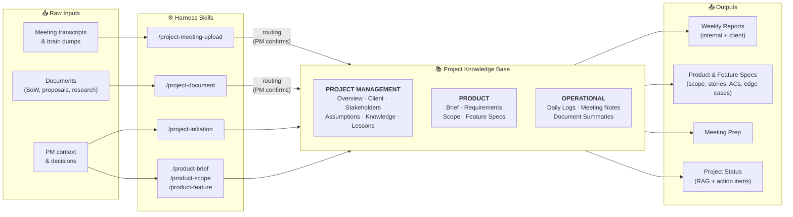

# Product Harness

> AI-powered project and product management for PMs — structured, consistent, and built on a knowledge base readable by humans and AI agents alike.

## Table of Contents

- [Quick Start](#quick-start)
- [1. What is the Product Harness?](#1-what-is-the-product-harness)
- [2. How It Works](#2-how-it-works)
- [3. The Project Knowledge Base](#3-the-project-knowledge-base)
- [4. How It Connects to a Product Discovery Process](#4-how-it-connects-to-a-product-discovery-process)
- [5. Core Concepts](#5-core-concepts)
- [6. Project Lifecycle Walkthrough](#6-project-lifecycle-walkthrough)
  - [Brownfield Onboarding](#brownfield-onboarding-existing-codebase--backlog)
- [7. Command Reference](#7-command-reference)
- [8. How to Think About It](#8-how-to-think-about-it)
- [9. Dos and Don'ts](#9-dos-and-donts)
- [10. Getting Started](#10-getting-started)
- [11. FAQ](#11-faq)
- [12. Planned Enhancements](#12-planned-enhancements)
- [13. Inspiration & Credits](#13-inspiration--credits)

---

## Quick Start

1. **Create your repo** — use this template on GitHub to create a new private repo named `product-{projectname}` (e.g., `product-phoenix`)
2. **Clone it** — `gh repo clone your-org/product-{projectname}`
3. **Open Claude Code** in the cloned directory — `claude`
4. **Run `/project-initiation`** — follow the guided setup to create all foundational artifacts

From there: upload documents with `/project-document`, process meetings with `/project-meeting-upload`, shape the product with `/product-brief`, `/product-scope`, and `/product-feature`. See the [full guide below](#1-what-is-the-product-harness) for details.

---

## 1. What is the Product Harness?

The Product Harness is an AI co-pilot for project and product management. It runs inside Claude Code (an AI-powered terminal) and works through conversation — you talk to it, give it commands, and it produces structured outputs.

**In practical terms:** You have an AI partner that maintains your project knowledge, processes meetings and documents, tracks delivery health, produces weekly reports, and helps you shape product specifications — all in a structured, consistent way across every client engagement.

### What changes

| Before | With the Harness |
|--------|-----------------|
| Project knowledge scattered across Notion, FigJam, Slack, Google Docs, and your head | Single structured knowledge base in one place |
| PM manually writes every spec, requirement, user story, and report | AI drafts, PM reviews and confirms |
| Meeting notes stay in a doc — insights never reach the right artifact | Meeting content is automatically routed to relevant artifacts |
| Weekly status reports written from memory and scattered notes | Weekly summaries synthesized from daily context logs |
| New team members ask the same questions repeatedly | Project knowledge base is always current and queryable |
| Context lost between sessions, handoffs, and holidays | Every decision, assumption, and change is tracked with an audit trail |

### What doesn't change

- **You still run workshops and client relationships.** The harness doesn't attend meetings — it processes what happened after.
- **You still make decisions.** The harness proposes, routes, and drafts. You confirm, adjust, or reject.
- **You still own the product.** Creative judgment, stakeholder management, and strategic thinking remain yours.
- **Design and engineering workflows stay the same.** The harness covers PM work, not Figma or code.

### The key shift

**PM moves from author to reviewer.** Instead of writing everything from scratch, you feed the harness raw input (meeting transcripts, brain dumps, documents) and it produces structured outputs. Your job shifts to confirming, adjusting, and routing — which is faster and produces more consistent results.

---

## 2. How It Works



---

## 3. The Project Knowledge Base

This is the most important concept in the harness.

### The problem it solves

In a typical client engagement, project knowledge lives in 6+ tools: FigJam boards, Notion pages, Figma files, Slack threads, Google Docs, and Google Meet recordings. No single system sees the full picture. When a new team member joins, onboarding takes days. When a PM goes on holiday, context is lost. When the AI needs to help, it can't reason across fragmented sources.

### How the harness solves it

The harness builds a **comprehensive, structured project knowledge base** stored as plain Markdown files in a Git repository. Every artifact — project overview, client intelligence, stakeholder map, assumptions, requirements, product scope, feature specs, meeting notes, daily logs — lives in one place, in a consistent format.

This knowledge base has two audiences:

- **Humans** — PMs, leadership, and team members can read any artifact directly. Plain Markdown is readable everywhere: GitHub, VS Code, any text editor. No special tool needed.
- **AI agents** — The structured format (YAML frontmatter, consistent sections, cross-references) means AI can load, reason about, and update these artifacts. The harness AI reads your project knowledge at the start of every session and stays in context. Future AI agents (research, QA, development) can tap into the same knowledge base.

**This is the foundation everything else builds on.** Routing, daily logs, weekly reports, feature specs — they all read from and write to this knowledge base. It accumulates intelligence over the life of the project and nothing falls through the cracks.

### What's in the knowledge base

| Category | Artifacts | What they capture |
|----------|-----------|-------------------|
| **Project management** | Project overview, client overview, stakeholders, assumptions & decisions, lessons learned, project knowledge | Who, what, why, for whom, how we work together, what we've learned |
| **Product** | Product brief, requirements, scope (per phase), feature specs | Problem space, solution space, delivery tracking, implementation detail |
| **Operational** | Daily logs, weekly summaries, meeting notes, document summaries | What happened, what was decided, what's next — the project's living memory |

---

## 4. How It Connects to a Product Discovery Process

The harness doesn't replace your product discovery process — it accelerates and structures it. Here's how harness capabilities map to discovery phases:

### Phase 0: Project Intake

| Discovery activity | Harness equivalent |
|---|---|
| Project setup from PM context | `/project-initiation` — bootstraps all foundational artifacts from conversational PM input (documents are ingested after via `/project-document`) |
| Discovery kickoff notes | `/project-meeting-upload` — processes kickoff transcript into structured notes + routes insights to artifacts |

**What changes:** Instead of manually extracting project parameters from a SoW into scattered Notion pages, you run `/project-initiation`, provide context conversationally, and get all structured artifacts created in minutes. Then upload the SoW via `/project-document` to enrich them.

### Phase 1: Discovery

| Discovery activity | Harness equivalent |
|---|---|
| Client interview sessions | `/project-meeting-upload` — processes transcript, extracts requirements, routes to artifacts |
| Workshop outputs (sticky notes, decisions, scope) | `/project-meeting-upload` — processes brain dump or notes from workshops |
| Requirements documentation | `/product-requirements` — review and manage structured requirements |
| Research findings, client documents | `/project-document` — ingests any document, summarizes, routes intelligence |
| Domain knowledge capture | Automatically accumulated in `project-knowledge.md` via routing |
| Assumptions & decisions tracking | `/project-assumptions` — managed with status tracking and impact analysis |

**What changes:** The synthesis bottleneck shrinks dramatically. Instead of spending days turning workshop sticky notes and interview transcripts into structured deliverables, you upload the raw material and the harness drafts the structured output. You review and confirm.

### Phase 1C: Synthesis & Deliverables

| Discovery activity | Harness equivalent |
|---|---|
| Problem statement definition | `/product-brief` — coaching session that shapes the product brief |
| Product roadmap & phasing | `/product-scope` — creates phase-level scope with epics and features |
| Feature specification (user stories, ACs) | `/product-feature` — detailed spec with acceptance criteria, edge cases |
| Stakeholder map maintenance | `/project-stakeholders` — living stakeholder document with sentiment tracking |

**What changes:** Feature specification — the single most time-consuming discovery activity — becomes a guided process. The harness drafts user stories and acceptance criteria from your requirements and scope. You edit, not author.

### Phase 2: Handoff & Ongoing

| Discovery activity | Harness equivalent |
|---|---|
| Status reporting | `/project-weekly` — management-grade weekly from daily logs |
| Client communication | `/project-weekly-client` — sensitivity-filtered client version |
| Knowledge transfer | The knowledge base itself — new team members read artifacts, AI answers questions from full context |
| Meeting prep | `/project-meeting-prep` — generates prep docs from harness context |

**What changes:** Weekly reporting is synthesized from what actually happened (daily logs), not written from memory on Friday afternoon. Client versions are generated with sensitivity filters so nothing internal leaks.

---

## 5. Core Concepts

### Artifacts

Artifacts are the building blocks of the knowledge base. Each artifact is a Markdown file with YAML frontmatter that tracks ownership, last update, and how it was modified. Artifacts are the **source of truth** — not your chat history, not your memory of a conversation.

Key artifacts you'll interact with most:

| Artifact | What it is | When you'll use it |
|----------|-----------|-------------------|
| `project-daily` | Daily context log — status, events, action items | Created automatically each session; your continuity mechanism |
| `project-overview` | Living engagement summary | Review at project start, update at milestones |
| `client-overview` | Client intelligence — company, market, relationship | Enrich early, reference before client meetings |
| `project-stakeholders` | People map — roles, influence, sentiment | Update after every meeting with new people signals |
| `project-assumptions` | Ideas, assumptions, decisions with impact analysis | Review regularly — this is your decision log |
| `product-brief` | Strategic product document — problem, personas, goals | Shape during discovery, reference for alignment |
| `product-scope` | Phase-level delivery tracker — epics, features, status | Your delivery dashboard |
| `product-feature` | Individual feature specs — stories, ACs, edge cases | One per feature, detailed enough to build from |

### Commands (Skills)

You interact with the harness through **slash commands** — type them in Claude Code and the harness runs a structured workflow. Commands are not freeform chat; they're specific skills with defined inputs, steps, and outputs.

Commands fall into three groups:

**Project management** — maintain the project knowledge base
```
/project-initiation      Start a new project
/project-overview        Review and update project overview
/client-overview         Review and enrich client intelligence
/project-stakeholders    Review stakeholders
/project-assumptions     Review assumptions and decisions
/project-knowledge       Review the project encyclopedia
/project-lessons         Review lessons learned
/project-daily           Query across daily logs
/project-weekly          Generate internal weekly summary
/project-weekly-client   Generate client-safe weekly
```

**Knowledge processing** — feed information into the harness
```
/project-meeting-upload  Process meeting transcript or notes
/project-meeting-prep    Generate meeting prep from harness context
/project-document        Ingest any document (SoW, proposal, research)
```

**Product management** — shape the product
```
/product-brief           Enrich the product brief via coaching Q&A
/product-requirements    Review and manage requirements
/product-scope           Create or update phase-level scope
/product-feature         Create or update a feature specification
/product-codebase-audit  Analyze existing codebase into a product baseline
/product-backlog-import  Import planned work from external backlog tool
```

### Routing

Routing is how information flows from input to the right artifacts. When you upload a meeting transcript or ingest a document, the harness doesn't just store it — it **extracts intelligence and proposes where it should go**.

Example: You upload a client interview transcript. The harness might propose:
- New stakeholder discovered → `project-stakeholders`
- Assumption about data model → `project-assumptions`
- Requirement mentioned → `product-requirements`
- Domain term clarified → `project-knowledge`
- Decision made → `project-assumptions` (as decided)

**You always confirm routing before anything is written.** The harness proposes, you approve. This is a critical interaction — don't skip it.

### Daily / Weekly Rhythm

The harness maintains context through a daily/weekly cycle:

- **Daily logs** (`project-daily`) are created each session. They capture project status (RAG — Red/Amber/Green), action items, key events, and an audit trail of every artifact change. They're your session continuity — when a new conversation starts, the harness reads recent dailies to get up to speed.

- **Weekly summaries** (`project-weekly`) are synthesized from the week's daily logs. They're management-grade status reports generated from what actually happened, not written from memory. An internal version for internal leadership and optionally a client-safe version.

**The rhythm:** Start a session → harness reads recent context → you do work → harness logs it → repeat. Over time, this builds a complete timeline of the project's evolution.

### Audit Trail

Every change to an artifact is logged. When the harness writes to an artifact (via routing, command, or auto-update), it records:
- What was changed
- Which skill or action triggered it
- Whether it was automatic or PM-confirmed

This means you can always trace **why** an artifact says what it says. No mystery data, no "who wrote this and when?"

---

## 6. Project Lifecycle Walkthrough

Here's what a typical project looks like through the harness, from day one through ongoing delivery.

### Week 0: Project setup (30 minutes)

1. **Create your repo** from the harness template on GitHub
2. **Clone it** and open Claude Code in the directory
3. **Run `/project-initiation`** — the harness asks you conversational questions about the project, client, team, and goals. From your answers, it creates all foundational artifacts: project overview, client overview, stakeholder map, product brief, project knowledge, daily log, skeleton files for assumptions, lessons, and requirements, plus index files and a personalized README.

You now have a structured project knowledge base from a single conversation.

### Week 1: Feed it everything you have

4. **Upload the SoW or proposal** — run `/project-document` and paste/reference the document. The harness summarizes it and routes extracted intelligence to the right artifacts (requirements to `product-requirements`, goals to `product-brief`, stakeholders to `project-stakeholders`).

5. **Upload meeting transcripts** — after each client session, run `/project-meeting-upload`. The harness processes the transcript into structured notes and routes insights. Do this for the kickoff, interviews, workshops — everything.

6. **Enrich as you go** — run `/client-overview` to deepen client intelligence, `/product-brief` for a coaching session on product strategy, `/project-stakeholders` to flesh out the people map.

### Weeks 2-4: Discovery work

7. **Keep uploading meetings and documents** — every client session, every research finding, every document the client shares. The knowledge base grows with each upload.

8. **Shape the product** — run `/product-scope` to define the delivery scope with epics and features. Run `/product-feature` for detailed specs on priority features.

9. **Track assumptions and decisions** — `/project-assumptions` to review what's been decided, what's still open, what needs validation.

10. **Prepare for meetings** — `/project-meeting-prep` generates prep docs from the full harness context so you walk in informed.

### Ongoing: Weekly rhythm

11. **Daily**: Start Claude Code → harness catches up from recent dailies → you work → harness logs what happened.

12. **Friday (or whenever needed)**: Run `/project-weekly` to generate the internal status summary. Review and confirm. Optionally run `/project-weekly-client` for the client version.

13. **Push to GitHub** regularly — that's your persistence and backup.

### Brownfield Onboarding (existing codebase + backlog)

If you're adding the harness to a project that already has a built product and/or an existing backlog, the setup flow has extra steps after initiation. The order matters — context-generating skills run before context-consuming ones, so each subsequent step reasons against richer ground.

`/project-initiation` presents this list after setup completes for brownfield projects. Entry point: `/project-initiation` with the GH repo URL.

1. **Run `/project-initiation`** — when asked about product state, say "brownfield" and provide the GitHub repo URL. The harness stores it and presents the follow-up list tailored to brownfield.
2. **Upload project documents** — `/project-document` — SoW, PRDs, proposals, contracts, strategy decks. Loading these first makes every downstream skill smarter.
3. **Upload past meetings** — `/project-meeting-upload` — kickoff transcripts, discovery notes, past calls. Feed as much early-context data as possible before the codebase audit.
4. **Analyze the codebase** — `/product-codebase-audit` — two-mode. The default run clones the repo, analyzes it from a product perspective, and produces a 9-section product baseline at `documents/internal/codebase-analysis/…` with `status: routing-preparation`. Review, edit, then run `/product-codebase-audit route` to write directly into harness artifacts (product-brief, product-scope, product-requirements, project-knowledge, project-assumptions, project-overview) and flip the baseline to `status: routing-done`. Refresh mode (`/product-codebase-audit refresh`) re-analyzes against the prior baseline with `[new]`/`[changed]`/`[status-changed]`/`[removed]` tags.
5. **Enrich the product brief** — `/product-brief` — coaching session that now benefits from documents, meetings, and the code-derived baseline already loaded.
6. **Import the backlog** — `/product-backlog-import` — two-mode. Run it after the above so it can reason about groupings, velocity, and priority with full context; running cold produces weaker proposals. The default run produces a backlog import plan at `documents/internal/backlog-import/…` with `status: routing-preparation`. Review, edit, then run `/product-backlog-import route` to write FEATs into scope (with canonical columns and Type), populate the Suggested Spec Order section, and flush velocity insights / lessons / assumptions / terms into their target artifacts. Update mode supports mid-project catch-up imports.
7. **Polish delivery scope** — `/product-scope {phase-slug}` — once the audit and backlog-import route passes have landed initial scope structure, polish rather than author from scratch.
8. **Enrich client profile** — `/client-overview` — fill client-intelligence gaps last.

The list is a recommendation, not a hard workflow gate — steps can be skipped or reordered, but the above order produces the strongest downstream results.

---

## 7. Command Reference

### `/project-initiation`

**When:** Once, at project start.
**What it expects:** Conversational input about the project — client name, project name, team members, goals, timeline, anything you know.
**What it produces:** All foundational artifacts — project overview, client overview, stakeholder map, product brief, project knowledge, daily log, skeleton files for assumptions, lessons, and requirements, index files, personalized README, and CLAUDE.md configuration.
**How it works:** Two conversational beats maximum. First beat collects context, optional second beat fills critical gaps. Then it autonomously creates all artifacts.

### `/project-meeting-upload`

**When:** After every meeting — client call, internal sync, workshop, interview.
**What it expects:** Meeting transcript, notes, or brain dump (paste directly or reference a file).
**What it produces:** Structured meeting notes (stored in `meetings/`) + routing proposals to relevant artifacts.
**Key interaction:** Review and confirm the routing before it writes to artifacts.

### `/project-document`

**When:** When you receive a document — SoW, proposal, research report, client-shared material.
**What it expects:** The document content (paste or reference).
**What it produces:** Document summary (stored in `documents/`) + routing proposals.
**Key interaction:** Same as meetings — confirm routing.

### `/product-brief`

**When:** During discovery, to shape product strategy.
**What it expects:** A coaching conversation — the harness asks questions to fill gaps in the brief.
**What it produces:** Enriched `product-brief.md` with problem definition, personas, goals, solution direction.

### `/product-scope`

**When:** When defining what gets built and in what order.
**What it expects:** Context from briefs, requirements, and your input on phasing/priorities.
**What it produces:** Phase-level scope document with epics, features (FEAT-NNN IDs), delivery status tracking.

### `/product-feature`

**When:** When specifying an individual feature in detail.
**What it expects:** A feature identified in product-scope (FEAT-NNN).
**What it produces:** Feature spec with user stories, acceptance criteria (Given/When/Then), edge cases, technical constraints, dependencies.

### `/project-weekly`

**When:** Weekly (typically Friday), or whenever you need a status summary.
**What it expects:** Nothing — it reads from daily logs automatically.
**What it produces:** Management-grade internal weekly summary with RAG status, narrative summary, decisions, risks, action items.
**Key interaction:** Review and confirm before it's finalized.

### `/project-weekly-client`

**When:** After the internal weekly is confirmed.
**What it expects:** An existing internal weekly for the same week.
**What it produces:** Client-safe version with sensitivity filters applied — progress-oriented language, no internal commentary, constructive risk framing.

### Other commands

| Command | Purpose |
|---------|---------|
| `/project-overview` | Review and update the project overview |
| `/client-overview` | Review and enrich client intelligence |
| `/project-stakeholders` | Review and update the stakeholder map |
| `/project-assumptions` | Review assumptions, decisions, and their impact |
| `/project-knowledge` | Review and enrich the project encyclopedia |
| `/project-lessons` | Review captured lessons learned |
| `/project-daily` | Query across daily logs — action items, events, trends |
| `/project-meeting-prep` | Generate meeting prep from harness context |
| `/product-requirements` | Review and manage requirements |
| `/product-codebase-audit` | Analyze an existing codebase and produce a product baseline |
| `/product-backlog-import` | Import planned work from an external backlog tool |

---

## 8. How to Think About It

### It's a knowledge system, not a chatbot

Don't think of the harness as "chatting with AI." Think of it as maintaining a living project knowledge base with an AI assistant that helps you keep it structured, current, and complete. The artifacts are the product — the conversation is just the interface.

### Feed it raw, not polished

The harness is designed to process messy input: unedited meeting transcripts, rough brain dumps, rambling notes. You don't need to clean things up before uploading. In fact, raw input is better — it contains nuance and detail that gets lost when you summarize prematurely.

### Confirm routing — this is your most important interaction

When the harness proposes routing (after meeting uploads or document ingestion), **read the proposals and confirm deliberately**. This is where you exercise PM judgment: Does this requirement really belong in the requirements doc? Is this actually a decision, or still an open assumption? Careless confirmation degrades the knowledge base.

### Trust the artifacts, not your memory

After a few weeks, your harness artifacts will know more about your project than you can hold in your head. When preparing for a meeting, read the artifacts. When someone asks about a decision, check `project-assumptions`. When writing a proposal, reference `product-scope`. The knowledge base is your extended memory.

### `-tbd-` is fine

Unknown fields are marked `-tbd-`, never guessed. A knowledge base with honest gaps is more trustworthy than one with fabricated data. Gaps get filled as information arrives — through meeting uploads, document ingestion, and enrichment sessions.

### Push to GitHub

The harness stores everything as files in a Git repository. **Push regularly.** This is your backup, your version history, and your collaboration mechanism. The harness will remind you, but make it a habit.

### It gets better over time

The first session creates a foundation. Each meeting you upload, each document you ingest, each enrichment session you run — the knowledge base deepens. By week 3-4 of a project, the harness has comprehensive context that makes everything faster: meeting prep is richer, weekly reports are more accurate, feature specs draw from real requirements.

---

## 9. Dos and Don'ts

### Do

- **Upload every meeting transcript** — even short syncs contain signals that get routed to the right places
- **Upload documents early** — SoW, proposals, research. The sooner it's in the knowledge base, the sooner it informs everything else
- **Review routing proposals carefully** — this is where data quality is made or broken
- **Run `/project-weekly` on Fridays** — build the habit; the weekly is only as good as the dailies that feed it
- **Push to GitHub after every session** — persistence and backup
- **Use commands, not freeform requests** — commands trigger structured skills with defined quality standards
- **Correct the harness when it's wrong** — it learns from your corrections within the session
- **Start each session in Claude Code from the project directory** — the harness reads CLAUDE.md and recent dailies to get in context

### Don't

- **Don't skip routing confirmation** — rubber-stamping "yes to all" puts wrong data in wrong places
- **Don't edit artifacts by hand** (outside of the harness) unless you have a specific reason — the harness tracks changes via audit trail, and manual edits bypass that. (The Notes column in scope feature tables is append-only *for harness-routed writes* — if you want to tidy or shorten your own Notes entries by hand, that's fine; the append rule only constrains what routing skills write, not your own edits.)
- **Don't expect it to attend meetings** — it processes recordings and notes after the fact
- **Don't paste partial transcripts** — give it the full meeting; it decides what's relevant
- **Don't duplicate information across artifacts** — if it's in `project-assumptions`, don't also copy it into `project-overview`. The harness maintains single sources of truth
- **Don't ignore `-tbd-` fields forever** — they're honest gaps, but they should shrink over the project lifecycle as you feed more information
- **Don't treat the AI conversation as the record** — conversations are ephemeral; artifacts are permanent. If something important was discussed, make sure it landed in an artifact

---

## 10. Getting Started

### Prerequisites

1. **VS Code or Cursor** — your IDE
2. **Homebrew** — package manager for macOS (`/bin/bash -c "$(curl -fsSL https://raw.githubusercontent.com/Homebrew/install/HEAD/install.sh)"`)
3. **Node.js** — `brew install node`
4. **Claude Code** — `npm install -g @anthropic-ai/claude-code`, then run `claude` once to authenticate
5. **GitHub CLI** — `brew install gh`, then `gh auth login`

### Your first project

1. **Create your repo** — use the Product Harness template on GitHub to create a new private repo named `product-{projectname}` (e.g., `product-phoenix`)
2. **Clone it** — `gh repo clone your-org/product-{projectname}`
3. **Open Claude Code** — navigate to the directory and run `claude`
4. **Run `/project-initiation`** — answer the questions conversationally. Don't worry about being comprehensive — you can enrich later.
5. **Upload your first document** — if you have a SoW or proposal, run `/project-document` immediately
6. **Push to GitHub** — `git push`

You're set up. From here, upload meetings and documents as they happen, and use commands to shape the product as discovery progresses.

---

## 11. FAQ

**Q: Do I need to be technical to use this?**
No. You work through conversation and slash commands. The harness handles file creation, Git operations, and structure. Basic familiarity with a terminal (opening it, typing commands) is all you need.

**Q: What if the harness gets something wrong?**
Correct it. Say "that's wrong, it should be X" and it will fix the artifact. If it routes something to the wrong place, say so during the routing review. The harness improves within the session based on your corrections.

**Q: Can I use this for projects already in progress?**
Yes. Run `/project-initiation` and indicate that this is a brownfield project with an existing codebase. Upload existing documents and meeting notes, then run `/product-codebase-audit` to analyze the repo and `/product-codebase-audit route` to write findings into harness artifacts. Then run `/product-backlog-import` to pull in existing planned work from your backlog tool and `/product-backlog-import route` to write FEATs into scope. See [Brownfield Onboarding](#brownfield-onboarding-existing-codebase--backlog) for the full ordered flow.

**Q: What happens if I forget to push to GitHub?**
Your work is saved locally but not backed up or visible to others. The harness reminds you to push, but if you forget, nothing is lost — just push next time.

**Q: Can other team members see the knowledge base?**
Yes — it's a GitHub repository. Anyone with access can read the artifacts. Currently, the harness conversation itself is single-user (one PM per project), but the knowledge base it produces is accessible to anyone.

**Q: How does this relate to Notion / FigJam / Linear?**
The harness doesn't replace these tools for their primary purpose (design in Figma, development tickets in Linear, collaborative workshops in FigJam). It replaces the PM's documentation and synthesis work that currently lives in scattered Notion pages. Over time, integrations may bridge these tools.

**Q: What if I need to hand off the project to another PM?**
The knowledge base is the handoff. The new PM opens Claude Code in the project directory and has full context: every decision, every assumption, every meeting processed, every requirement captured. This is one of the harness's biggest advantages over the current process where context lives in people's heads.

---

## 12. Planned Enhancements

- **`project-sync`** — Connect to project tools (primarily Slack) and auto-update project context with new insights from these tools
- **`product-journey`** — Augment customer journey / use-case documentation and visualization
- **`product-roi`** — Assist with business case calculation for particular parts of the product scope
- **`project-retro`** — Facilitate internal or client retrospective meetings
- **`product-harness-MCP`** — Enable agentic connection with product harness content via MCP server
- **Feature status tracking automation** — Connect to CI/CD pipeline for automatic feature delivery status updates
- **Feature / epic estimation** — Guide the PM through effort estimation process for features and epics

---

## 13. Inspiration & Credits

This project builds on ideas and patterns from:

- [Dean Peters — Product Manager Skills](https://github.com/deanpeters/Product-Manager-Skills)
- [Pavel Huryn — PM Skills](https://github.com/phuryn/pm-skills)
- [GitHub — Spec Kit](https://github.com/github/spec-kit)
- [Fission AI — OpenSpec](https://github.com/Fission-AI/OpenSpec)
